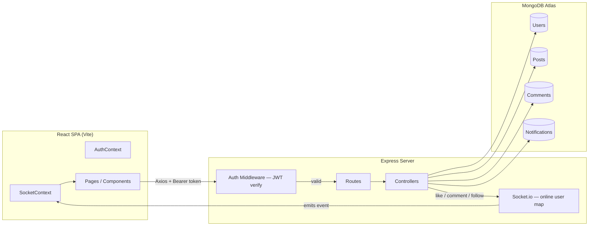

# ConnectSphere

A full-stack social media platform — React frontend, Node.js/Express/MongoDB backend, JWT authentication, and real-time notifications via Socket.io.

> Week 5–6 Capstone Task — MERN Stack Summer Internship, The Tech Pulses

Extends the [Week 4 Blog API](https://github.com/ahmedsufian10/connectsphere-api/tree/main) into a portfolio-worthy social app: follow/feed system, likes, comments, live notifications, and image uploads, all sitting behind real JWT auth.

---

## Table of Contents

- [Overview](#overview)
- [Tech Stack](#tech-stack)
- [Architecture](#architecture)
- [Project Structure](#project-structure)
- [Data Models](#data-models)
- [API Reference](#api-reference)
- [Real-Time Notifications](#real-time-notifications)
- [Setup](#setup)
- [Testing](#testing)
- [Security Notes](#security-notes)

---

## Overview

ConnectSphere is a two-sided project: an Express/MongoDB REST API (`server/`) and a React/Vite single-page app (`client/`) that consumes it. Every protected route checks a JWT server-side — the UI hides buttons for convenience, but ownership and auth are enforced on the backend, not just in the interface.

The backend reuses and extends the Week 4 Blog API's User, Post, and Comment models rather than rebuilding them, and adds a Notification model plus a Socket.io layer for live updates.

---

## Tech Stack

| Layer | Technology | Purpose |
|---|---|---|
| Runtime | Node.js | Server runtime |
| Framework | Express.js | Routing and HTTP handling |
| Database | MongoDB Atlas | Cloud-hosted NoSQL storage |
| ODM | Mongoose | Schemas, models, queries |
| Auth | jsonwebtoken | Stateless JWT authentication |
| Password hashing | bcryptjs | Replaces Week 4's plain-text passwords |
| File uploads | Multer | Multipart form-data handling, stored locally under `server/uploads/` |
| Real-time | Socket.io | Live notification delivery to online users |
| Validation | express-validator | Input validation and sanitization |
| Frontend | React (Vite) | Single-page app |
| Routing | React Router | Client-side routing |
| State | Context API | Auth session (`AuthContext`) and socket connection (`SocketContext`) |
| HTTP client | Axios | API requests with an auth header interceptor |
| Testing | Postman | Manual endpoint testing |

---

## Architecture



---

## Project Structure

```
connectsphere-api/
├── server/
│   ├── server.js                    → Entry point — DB connection, Socket.io setup, online-user map
│   ├── .env.example                   → Template for required environment variables
│   ├── .gitignore                      → node_modules, .env, uploads/* (except .gitkeep)
│   ├── uploads/                         → Local image storage (Multer target)
│   │
│   ├── config/
│   │   └── db.js                          → Mongoose connection logic
│   │
│   ├── models/
│   │   ├── User.js                          → Extended: avatar, coverPhoto, followers/following
│   │   ├── Post.js                           → Extended: likes array, image, tags
│   │   ├── Comment.js                         → Unchanged from Week 4
│   │   └── Notification.js                     → New — like/comment/follow events
│   │
│   ├── routes/
│   │   ├── authRoutes.js                        → /api/auth
│   │   ├── userRoutes.js                         → /api/users
│   │   ├── postRoutes.js                          → /api/posts
│   │   ├── commentRoutes.js                        → /api/comments
│   │   └── notificationRoutes.js                    → /api/notifications
│   │
│   ├── controllers/
│   │   ├── authController.js                        → Register, login, JWT issuance
│   │   ├── userController.js                         → Profile, follow/unfollow, search
│   │   ├── postController.js                          → CRUD, feed vs explore, likes
│   │   ├── commentController.js                        → Add/view/delete comments
│   │   └── notificationController.js                    → List, mark read
│   │
│   └── middleware/
│       ├── auth.js                                        → JWT verification, attaches req.user
│       ├── upload.js                                       → Multer config (type/size limits)
│       ├── validate.js                                      → Runs validation chains, formats 400s
│       └── errorHandler.js                                  → Global error handler + 404 handler
│
└── client/
    └── src/
        ├── App.jsx                     → Route definitions
        ├── main.jsx                     → App entry point
        ├── context/
        │   ├── AuthContext.jsx            → Login state, token, current user
        │   └── SocketContext.jsx           → Socket.io connection, online users
        ├── pages/
        │   ├── Login.jsx / Register.jsx
        │   ├── Feed.jsx / Explore.jsx
        │   ├── Profile.jsx / EditProfile.jsx
        │   └── PostDetail.jsx
        ├── components/
        │   ├── Navbar.jsx
        │   ├── PostCard.jsx / CreatePostForm.jsx
        │   └── AvatarImg.jsx
        └── utils/
            └── api.js                       → Axios instance with auth interceptor
```

---

## Data Models

### User (extended from Week 4)

| Field | Type | Rules |
|---|---|---|
| `name` | String | Required, trimmed, min 2 chars |
| `email` | String | Required, unique, valid format |
| `password` | String | Required, min 6 chars, hashed with bcrypt, never returned in queries |
| `bio` | String | Optional, max 200 chars |
| `avatar` | String | URL of uploaded profile picture |
| `coverPhoto` | String | URL of uploaded cover image, optional |
| `role` | String | Enum: `user`, `admin` — default `user` |
| `followers` | [ObjectId] | Refs to `User` — who follows this user |
| `following` | [ObjectId] | Refs to `User` — who this user follows |

### Post (extended from Week 4)

| Field | Type | Rules |
|---|---|---|
| `content` | String | Required, min 1, max 500 chars |
| `image` | String | Optional URL of uploaded post image |
| `author` | ObjectId | Required, ref `User` |
| `likes` | [ObjectId] | Refs to `User` who liked the post |
| `comments` | [ObjectId] | Refs to `Comment` |
| `tags` | [String] | Optional, max 5 |

### Comment (unchanged from Week 4)

| Field | Type | Rules |
|---|---|---|
| `text` | String | Required, min 1, max 300 chars |
| `author` | ObjectId | Required, ref `User` |
| `post` | ObjectId | Required, ref `Post` |

### Notification (new)

| Field | Type | Rules |
|---|---|---|
| `recipient` | ObjectId | Required, ref `User` — who receives it |
| `sender` | ObjectId | Required, ref `User` — who triggered it |
| `type` | String | Enum: `like`, `comment`, `follow` |
| `post` | ObjectId | Ref `Post`, optional — only for like/comment |
| `isRead` | Boolean | Default `false` |

---

## API Reference

All responses share one shape:

```jsonc
// Success
{ "success": true, "message": "...", "data": { ... } }

// Error
{ "success": false, "message": "Error description", "errors": [ ... ] }
```

### Auth — `/api/auth`

| Method | Endpoint | Access |
|---|---|---|
| POST | `/register` | Public — hashes password, returns signed JWT |
| POST | `/login` | Public — verifies credentials, returns signed JWT (7d expiry) |
| GET | `/me` | Protected — returns the logged-in user from the token |

### Users — `/api/users`

| Method | Endpoint | Access |
|---|---|---|
| GET | `/search?q=` | Protected — search users by name |
| GET | `/:id` | Protected — profile with posts populated |
| PUT | `/:id` | Protected, owner only — supports avatar/cover upload |
| POST | `/:id/follow` | Protected — toggle follow/unfollow |
| GET | `/:id/followers` | Protected |
| GET | `/:id/following` | Protected |

### Posts — `/api/posts`

| Method | Endpoint | Access |
|---|---|---|
| POST | `/` | Protected — create, supports image upload |
| GET | `/` | Protected — explore feed, paginated |
| GET | `/feed` | Protected — posts from followed users + own |
| GET | `/:id` | Protected — full post, author + comments populated |
| PUT | `/:id` | Protected, owner only |
| DELETE | `/:id` | Protected, owner only — cascades comment deletion |
| PATCH | `/:id/like` | Protected — toggle like |

### Comments — `/api/comments`

| Method | Endpoint | Access |
|---|---|---|
| POST | `/` | Protected |
| GET | `/post/:postId` | Protected |
| DELETE | `/:id` | Protected — comment or post owner only |

### Notifications — `/api/notifications`

| Method | Endpoint | Access |
|---|---|---|
| GET | `/` | Protected |
| PATCH | `/:id/read` | Protected |
| PATCH | `/mark-all-read` | Protected |

---

## Real-Time Notifications

`server.js` maintains an in-memory `Map` of `userId → socketId` for currently connected clients. When a user likes, comments on, or follows another user, the relevant controller creates a `Notification` document and — if the recipient is online — emits a Socket.io event directly to their socket.

The client's `SocketContext` connects on login, tracks the online-users list, and feeds incoming events to the notification bell UI without a page refresh.

---

## Setup

```bash
# Server
cd server
npm install
# create a .env file — see template below
npm run dev

# Client (separate terminal)
cd client
npm install
npm run dev
```

**Required server environment variables** (`server/.env` — not committed, use `.env.example` as a template):

```
PORT=5000
MONGODB_URI=mongodb+srv://<username>:<password>@<cluster-url>/connectsphere?appName=Cluster0
JWT_SECRET=<your-jwt-secret-key>
JWT_EXPIRES_IN=7d
CLIENT_URL=http://localhost:5173
```

The client has no required environment variables — it talks to the API via a hardcoded/relative base URL in `src/utils/api.js`.

Image uploads are stored locally under `server/uploads/` (served statically) rather than a cloud provider — no Cloudinary configuration is required for this build.

---

## Testing

A Postman collection (`server/postman_collection.json`) is included, organized by resource (Auth, Users, Posts, Comments, Notifications). Import it, set `baseUrl`, and run the register → login flow first so `{{token}}` gets populated for subsequent protected requests.

---

## Security Notes

- Passwords are hashed with bcrypt before storage — never stored or returned in plain text.
- All protected routes verify the JWT server-side via `middleware/auth.js` — the client hiding a button is not treated as sufficient protection anywhere in this codebase.
- Ownership checks (post edit/delete, comment delete) happen in the controller, not just the UI.
- `.env` is excluded from version control; only `.env.example` (with placeholder values) is committed.
- A user cannot follow themselves — validated server-side in `userController.js`, not just disabled in the UI.

---

*Built as part of the MERN Stack Summer Internship at The Tech Pulses — Week 5–6 Capstone Task.*
