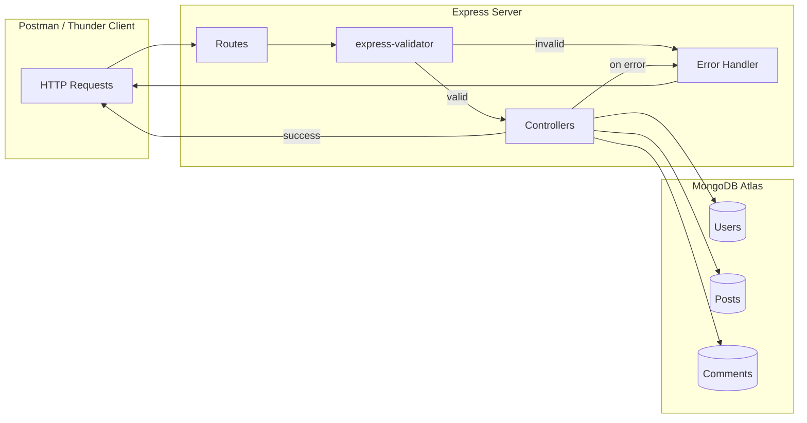

# BlogSphere API

A REST API backend for a blog platform, built with Node.js, Express, MongoDB, and Mongoose.

> Week 4 Task — MERN Stack Summer Internship, The Tech Pulses

---

## Table of Contents

- [Overview](#overview)
- [Tech Stack](#tech-stack)
- [Architecture](#architecture)
- [Project Structure](#project-structure)
- [Data Models](#data-models)
- [API Reference](#api-reference)
- [Filtering & Search](#filtering--search)
- [Error Handling](#error-handling)
- [Population](#population)
- [Cascading Deletes](#cascading-deletes)
- [Setup](#setup)
- [Testing](#testing)
- [Roadmap](#roadmap)

---

## Overview

BlogSphere is a pure backend project — there is no frontend by design. Every endpoint is meant to be tested through Postman or Thunder Client.

The goal of this task was to build a solid foundation in the M and E of MERN: designing schemas, writing controllers, wiring routes, handling errors properly, and connecting to a real cloud database.

This backend becomes the foundation for Weeks 5–6, where a React frontend and JWT authentication get layered on top of what's built here.

---

## Tech Stack

| Layer | Technology | Purpose |
|---|---|---|
| Runtime | Node.js | Runs the server outside the browser |
| Framework | Express.js | Routing and HTTP handling |
| Database | MongoDB Atlas | Cloud-hosted NoSQL storage |
| ODM | Mongoose | Schemas, models, queries |
| Config | dotenv | Environment variable management |
| Dev Tool | Nodemon | Auto-restart during development |
| Validation | express-validator | Input validation and sanitization |
| Testing | Postman | Manual endpoint testing |

---

## Architecture



---

## Project Structure

```
blogsphere-api/
├── server.js              → Entry point — connects DB, starts server
├── .env                    → PORT, MONGODB_URI (excluded from Git)
├── .gitignore               → node_modules, .env, logs
├── package.json
│
├── config/
│   └── db.js                  → Mongoose connection logic
│
├── models/
│   ├── User.js                  → User schema
│   ├── Post.js                   → Post schema
│   └── Comment.js                 → Comment schema
│
├── routes/
│   ├── userRoutes.js               → /api/users endpoints + validation chains
│   ├── postRoutes.js                → /api/posts endpoints + validation chains
│   └── commentRoutes.js              → /api/comments endpoints + validation chains
│
├── controllers/
│   ├── userController.js              → User business logic
│   ├── postController.js               → Post business logic
│   └── commentController.js             → Comment business logic
│
└── middleware/
    ├── errorHandler.js                   → Global error handler + 404 handler
    └── validate.js                        → Runs validation chains, formats 400s
```

---

## Data Models

### User

| Field | Type | Rules |
|---|---|---|
| `name` | String | Required, trimmed, min 2 chars |
| `email` | String | Required, unique, valid format |
| `password` | String | Required, min 6 chars *(plain text for now — hashing arrives in Weeks 5–6)* |
| `bio` | String | Optional, max 200 chars |
| `role` | String | Enum: `user`, `admin` — default `user` |
| `createdAt` | Date | Auto via `timestamps: true` |

### Post

| Field | Type | Rules |
|---|---|---|
| `title` | String | Required, min 5, max 150 chars |
| `content` | String | Required, min 20 chars |
| `category` | String | Enum: `Tech`, `Lifestyle`, `Education`, `Business`, `Other` |
| `tags` | [String] | Optional, max 5 tags |
| `author` | ObjectId | Required, ref `User` |
| `comments` | [ObjectId] | Refs to `Comment` |
| `likes` | Number | Default `0` |
| `isPublished` | Boolean | Default `false` |
| `createdAt` / `updatedAt` | Date | Auto via `timestamps: true` |

### Comment

| Field | Type | Rules |
|---|---|---|
| `text` | String | Required, min 2, max 500 chars |
| `author` | ObjectId | Required, ref `User` |
| `post` | ObjectId | Required, ref `Post` |
| `createdAt` | Date | Auto via `timestamps: true` |

---

## API Reference

All responses follow one consistent shape:

```jsonc
// Success
{ "success": true, "message": "...", "data": { ... } }

// Error
{ "success": false, "message": "Error description", "errors": [ ... ] }
```

### Users — `/api/users`

| Method | Endpoint | Description |
|---|---|---|
| POST | `/register` | Register a new user |
| POST | `/login` | Login with email + password |
| GET | `/` | Get all users *(no passwords)* |
| GET | `/:id` | Get one user, with published posts populated |
| PUT | `/:id` | Update name, bio, or role |
| DELETE | `/:id` | Delete user, cascades to their posts and comments |

### Posts — `/api/posts`

| Method | Endpoint | Description |
|---|---|---|
| POST | `/` | Create a post |
| GET | `/` | Get published posts — supports `?category`, `?tag`, `?search`, `?sort` |
| GET | `/all` | Get all posts including unpublished *(admin)* |
| GET | `/:id` | Get one post, author and comments fully populated |
| PUT | `/:id` | Update title, content, category, tags, or isPublished |
| PATCH | `/:id/like` | Increment likes by 1 |
| PATCH | `/:id/publish` | Toggle isPublished |
| DELETE | `/:id` | Delete post, cascades to its comments |

### Comments — `/api/comments`

| Method | Endpoint | Description |
|---|---|---|
| POST | `/` | Add a comment |
| GET | `/post/:postId` | Get all comments for a post, author name populated |
| PUT | `/:id` | Edit comment text |
| DELETE | `/:id` | Delete comment, removed from parent post's reference array |

---

## Filtering & Search

`GET /api/posts` supports optional query parameters that can be combined:

| Param | Example | Behavior |
|---|---|---|
| `category` | `?category=tech` | Exact match, case insensitive |
| `tag` | `?tag=javascript` | Matches posts containing this tag |
| `search` | `?search=react` | Regex search across title and content |
| `sort` | `?sort=popular` | `latest` (default) sorts by newest, `popular` sorts by likes |

---

## Error Handling

| Scenario | Status | Response |
|---|---|---|
| Invalid MongoDB ObjectId | `400` | Not a `500` crash — caught explicitly |
| Duplicate email on register | `409` | Clear conflict message with the field name |
| Validation failure on POST/PUT | `400` | Array of field-level error messages |
| Unmatched route | `404` | JSON response, never an HTML error page |

---

## Population

- `GET /api/posts/:id` returns the full author object (`name`, `email`), not just an id, and all comments with each comment's author name resolved.
- `GET /api/users/:id` returns the user's published posts array, fully populated.

---

## Cascading Deletes

| Action | Effect |
|---|---|
| Delete a user | Their posts are deleted, their comments are deleted, and any comments they wrote on others' posts are removed too |
| Delete a post | Every comment attached to that post is deleted |

---

## Setup

```bash
# 1. Install dependencies
npm install

# 2. Create a .env file in the project root with the variables below

# 3. Run in development (auto-restart on changes)
npm run dev

# 4. Or run in production mode
npm start
```

**Required environment variables** (create a `.env` file — not included in this repo):

```
PORT=5000
MONGODB_URI=mongodb+srv://<username>:<password>@<cluster-url>/blogdb?retryWrites=true&w=majority
```

> Note: no `.env.example` file is included yet. If you're setting this project up for the first time, create `.env` manually using the template above, and consider committing an `.env.example` with placeholder values so future setup doesn't rely on this README alone.

---

## Testing

A full Postman collection (`postman_collection.json`) is included, organized into **Users**, **Posts**, **Comments**, and **Error Handling Checks** folders. It covers:

- A valid request for every one of the 18 endpoints
- Invalid input triggering `400` validation errors
- Duplicate email registration triggering `409`
- Deleting a user and confirming their posts and comments are gone too

Import it into Postman, set the `baseUrl` variable to your running server, and run requests top to bottom — collection variables (`userId`, `postId`, `commentId`) get populated automatically as you go.

---

## Roadmap

This backend is scoped intentionally. JWT authentication, password hashing, and the React frontend are **not** part of Week 4 — they arrive in Weeks 5 and 6, built on top of what's here.

---

*Built as part of the MERN Stack Summer Internship at The Tech Pulses — Week 4 Task.*
